<h1 align="center">can-logger-esp32</h1>
<p align="center"><i>ESP32 CAN logger with optional DBC decoding</i></p>
<p align="center"><a href="https://github.com/mhmmdbdrhmd/can-logger-esp32/actions"></a>     <a href="https://github.com/mhmmdbdrhmd/can-logger-esp32/releases/tag/v1.1.1"></a></p>

> Log a CAN bus to SD with **nothing bus-specific compiled in** — identifiers, scaling and units all come from a DBC file on the card.

> [!IMPORTANT]
> **The receive path is field-proven; the newer parts are not.** The reader task,
> the driver and the controller configuration are the same code and the same
> constants that recorded hours of a 540 frame/s bus without losing a frame, on
> real hardware. What has *not* been on a live wire is everything added since:
> transmitting, the dashboard, and the frame-map allocation. Bench those against
> a node you can afford to confuse. → [Verification status](#13-verification-status)

<details open>
<summary><b>Contents</b></summary>
<br>

- [1. Hardware](#1-hardware)
- [2. Wiring](#2-wiring)
- [3. The frame map (`/frames.dbc`)](#3-the-frame-map-framesdbc)
- [4. Building and flashing](#4-building-and-flashing)
- [5. What gets recorded](#5-what-gets-recorded)
- [6. The live web app](#6-the-live-web-app)
- [7. Sending values back to the bus](#7-sending-values-back-to-the-bus)
- [8. Why it does not lose frames](#8-why-it-does-not-lose-frames)
- [9. Surviving a power cut](#9-surviving-a-power-cut)
- [10. Host-side tools](#10-host-side-tools)
- [11. Tuning](#11-tuning)
- [12. Troubleshooting](#12-troubleshooting)
- [13. Verification status](#13-verification-status)
- [14. Known issues](#14-known-issues)
- [15. Future development](#15-future-development)
- [License](#license)
- [Author](#author)

</details>

---

A CAN bus logger built from an ESP32 and an MCP2515: it captures **every frame
on the wire**, decodes it against a **DBC file you put on the SD card**, and
writes normalised CSV — with a live web dashboard that shows whatever that DBC
describes.

No frame identifier, signal name, scaling factor or unit is compiled into the
firmware. Give it a DBC and it logs named signals in engineering units. Give it
nothing and it logs raw frames. The same binary does both.

```
        any CAN bus                    ESP32 DevKit                phone / laptop
   ┌────────────────────┐         ┌────────────────────┐        ┌──────────────┐
   │  frames @ any rate │  CAN_H  │ MCP2515 ── ISR     │  WiFi  │  dashboard   │
   │                    │────────>│   queue ── decode  │<──────>│  live signals│
   └────────────────────┘  CAN_L  │   SD ── N.csv/N.log│   AP   │  live log    │
                                  └────────────────────┘  or STA└──────────────┘
                                        ▲
                                  /frames.dbc  ← your frame map
```

**Contents** · [Hardware](#1-hardware) · [Wiring](#2-wiring) ·
[Frame map](#3-the-frame-map-framesdbc) · [Build](#4-building-and-flashing) ·
[Output](#5-what-gets-recorded) · [Web app](#6-the-live-web-app) · [Sending](#7-sending-values-back-to-the-bus) ·
[Design](#8-why-it-does-not-lose-frames) · [Power cuts](#9-surviving-a-power-cut) ·
[Tools](#10-host-side-tools) · [Tuning](#11-tuning) ·
[Troubleshooting](#12-troubleshooting) ·
[Verification](#13-verification-status) · [Known issues](#14-known-issues) ·
[Future](#15-future-development) · [Changelog](CHANGELOG.md)

---

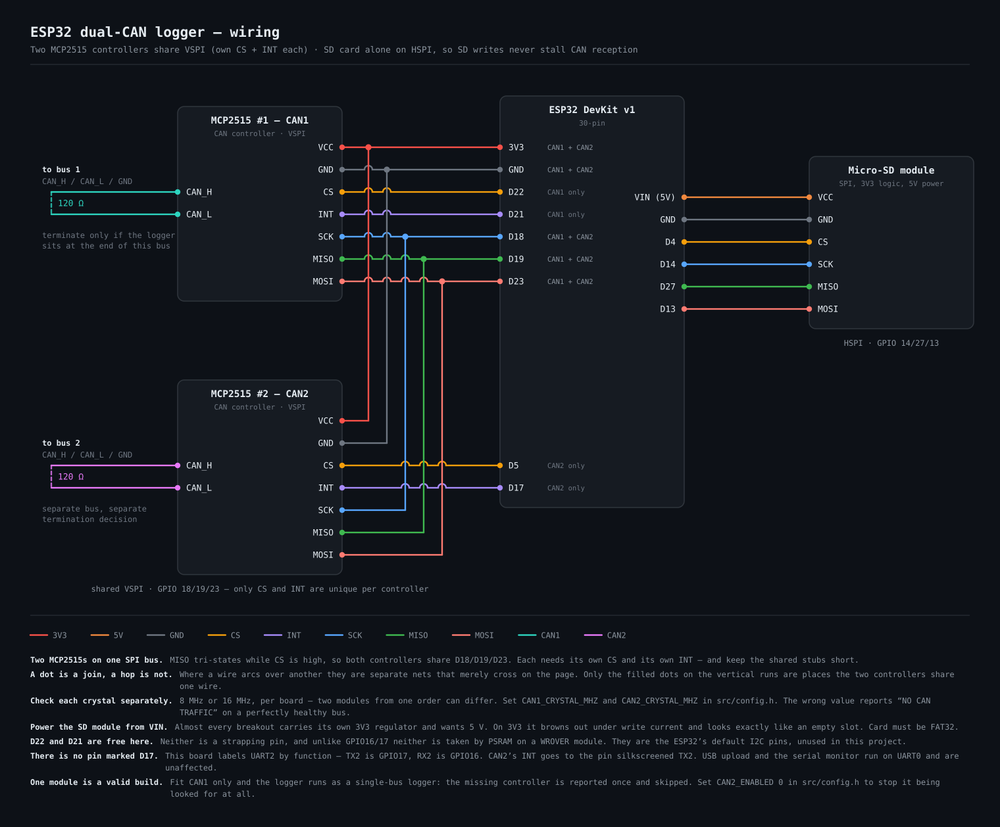


## 1. Hardware

| Part | Notes |
|---|---|
| **ESP32 DevKit v1** (30-pin) | Any ESP32 dev board works; the pin map below is for the 30-pin v1. |
| **MCP2515 + TJA1050 CAN module** | The common blue module. **Check the crystal** — 8 MHz or 16 MHz, see below. |
| **Micro-SD card module** (SPI) | 3V3 signalling, but **power it from 5V (VIN)** — see §2. |
| **Micro-SD card**, FAT32 | Class 10 or better. Cards over 32 GB usually ship as exFAT and must be reformatted. |
| 120 Ω resistor | Only if the logger sits at the physical end of the bus. |
| 6800 µF / 10 V electrolytic + a diode | Optional, for the power-fail input — see §8. |

Total, at the time of writing, well under the price of a commercial bus logger's
licence dongle.

> **Check the crystal on your MCP2515 board.** The common blue modules use
> 8 MHz; some clones use 16 MHz. Set `CAN_CRYSTAL_MHZ` in `src/config.h`.
> The wrong value gives "NO CAN TRAFFIC" on a perfectly healthy bus, and it is
> the single most common reason a first attempt sees nothing.

---

## 2. Wiring

Two separate SPI buses **on purpose**: an 8 KB SD write takes milliseconds, and
sharing one bus would stall CAN reads for exactly that long.

| MCP2515 | ESP32 | | SD card | ESP32 |
|---|---|---|---|---|
| VCC | 3V3 | | VCC | **5V (VIN)** |
| GND | GND | | GND | GND |
| CS  | **D5**  | | CS   | **D4**  |
| INT | **D17** | | SCK  | **D14** |
| SCK | D18 (VSPI) | | MISO | **D27** |
| MISO| D19 | | MOSI | **D13** |
| MOSI| D23 | | | (HSPI) |

> **Power the SD module from 5V (VIN), not 3V3.** Almost all micro-SD breakout
> boards carry their own 3V3 regulator and level shifters, and expect 5 V on
> VCC. On 3V3 the regulator has no headroom, the card browns out the moment it
> draws write current, and `SD.begin()` fails in a way that is indistinguishable
> from an empty slot. The SPI lines stay 3V3 either way. If your module is one
> of the bare ones with no regulator, 3V3 is correct for it — check the board.
>
> If the card still will not mount, it is usually the clock rather than the
> card: the firmware retries at 10, 4 and 1 MHz and logs which speed it took,
> because breadboard jumpers and cheap adapters often will not carry 20 MHz.

Bus side: `CAN_H` and `CAN_L` to the bus, `GND` to the bus ground. Default bit
rate is **250 kbit/s** (`CAN_BITRATE_KBPS`); 100, 125, 250, 500 and 1000 are
supported at either crystal frequency.

The on-board LED (D2) is steady off when idle, blinks slowly while recording and
blinks fast on an SD fault. Set `PIN_STATUS_LED` to `-1` to disable.

### Normal mode or listen-only

`CAN_LISTEN_ONLY` defaults to **0** (normal mode), so the logger acknowledges
frames. That is correct when it is the only other node on the bus — with nobody
to ACK, the talking node goes error-passive and eventually bus-off.

Set it to **1** when you are tapping a bus that already has two or more live
nodes. Listen-only never drives the bus at all, which is the safe choice on a
machine that is actually running.

---

## 3. The frame map (`/frames.dbc`)

This is the part that keeps the firmware generic. Everything the logger knows
about a bus comes from a **DBC file in the root of the SD card**, read once at
boot. Nothing is compiled in.

- **DBC present** → frames it describes are decoded into named signals in
  physical units, and both the CSV and the web page show those names.
- **DBC absent** → every frame is recorded as raw payload bytes. This is a
  supported mode, not a failure. You can decode the CSV offline later.
- **Both at once** → identifiers the DBC does not describe still get recorded,
  as raw bytes, alongside the decoded ones. A logger that silently drops the
  frames it does not recognise is a logger that lies about what was on the bus.

Copy [`examples/example.dbc`](examples/example.dbc) to the card as
`/frames.dbc` and edit it, or export one from your usual CAN tool. The path is
`DBC_PATH` in `src/config.h`.

### What the parser supports

| Construct | Support |
|---|---|
| `VERSION "…"` | Kept, and written into every CSV header |
| `BO_ <id> <Name>: <dlc> <Node>` | Yes. 29-bit ids carry bit 31 set, as usual. `<Node>` is the **transmitter** and is kept — see below |
| `BU_: <Node> …` | Yes — the node list, up to `DBC_MAX_NODES` |
| `SG_ … : <start>\|<len>@<order><sign> (<fac>,<off>) [min\|max] "<unit>"` | Yes |
| Byte order `@1` (Intel) and `@0` (Motorola) | Both |
| Signed and unsigned, 1–64 bits | Yes |
| Factor and offset | Yes — **exactly**, see below |
| Units | Yes, carried into the CSV and the dashboard |
| `VAL_` value tables | Yes — the CSV prints `running`, not `2` |
| Multiplexing (`M`, `m0`, `m1`, …) | Yes — a multiplexed signal is emitted only when the multiplexor selects it |
| `SIG_VALTYPE_ … : 1;` / `: 2;` | Yes — IEEE float32 and float64 payloads |
| `BA_ "Unwrap" SG_ <id> <Sig> 1;` | Yes — see [free-running counters](#free-running-counters) |
| `CM_`, `NS_`, `BS_`, `BA_DEF_` | Parsed past and ignored |

**The transmitter is the only direction a DBC states**, and it is half of what
you need. The file says `ABS_Cmd` is sent by `Tester`; it does not say whether
*you* are the tester. Answer that once — [which node this logger
is](#which-node-this-logger-is) — and the two Fill buttons can tell a command
from a reading. Nothing in the recording path acts on it either way: a frame
that arrives is recorded whoever the file says sends it.

**Deliberately not supported**, so you are not surprised later:

- **`[min|max]` is parsed but not enforced.** A logger records what is on the
  wire. Clamping a signal to its declared range would hide exactly the fault you
  bought the logger to find.
- **Signal groups, `SG_MUL_VAL_` (extended multiplexing), environment variables
  and attribute definitions other than `Unwrap`.** Extended multiplexing in
  particular is silently ignored: such a signal is treated as ordinary, which
  may decode nonsense on the pages where it is not present.
- **CAN FD** — the MCP2515 is a classical CAN controller. Payloads over 8 bytes
  do not exist here.
- **Receive filters.** The controller's acceptance filters are switched off on
  purpose. Everything on the bus is captured.

Anything the parser cannot make sense of is counted and reported at boot
(`N line(s) of /frames.dbc could not be parsed`), never skipped in silence.

### How big a frame map can be

**The tables are sized to your file, not to a number chosen at compile time.**
The file is read twice at boot — once to count `BO_`, `SG_` and `VAL_`, once to
parse — and the tables are then allocated to fit it. A twenty-signal bus costs
about two kilobytes; a 104-message, 707-signal J1939 steering bus costs about
84 KB and loads whole.

That is a fix, not a feature. The tables used to be fixed at 64 messages and 256
signals, and a real ten-hour field recording on that steering bus decoded the
first 256 signals and wrote the other **451 as raw payload bytes**, with one
line in the CSV header to say so.

Three things still bound it, and all three are reported at boot:

| Bound | Default | What happens |
|---|---|---|
| `DBC_MAX_MESSAGES` / `DBC_MAX_SIGNALS` / `DBC_MAX_VALDESC` | 256 / 1024 / 2048 | Ceilings, so a corrupt file cannot ask for a gigabyte. Exceeding one truncates the map and says so |
| `DBC_HEAP_RESERVE` | 90 KB | Memory the map will **not** take. It loads before the radio starts, so an unbounded map could leave Wi-Fi with nothing. Over budget, the request is scaled down proportionally |
| `DBC_MAX_NODES` | 32 | Names in `BU_`. The only fixed table left, at a kilobyte |

The boot line reports what it cost and what is left:

```
I frame map: 104 messages, 707 signals from /frames.dbc (84 KB, 118 KB free)
```

If it had to cut the map back, it names the knob:

```
W frame map wants 138 KB, 205 KB free - keeping 115 KB and leaving 90 KB for
  Wi-Fi. If the logger runs with plenty spare, lower DBC_HEAP_RESERVE in config.h.
```

`python3 tools/check_dbc.py yours.dbc` prints the same estimate before you go
anywhere near the machine.

### How long a name can be

`DBC_NAME_MAX` is 32, so **31 characters** of message and signal name reach the
CSV. It was 24, which wrote `GuidanceCurvatureCommand` as
`GuidanceCurvatureComman` — long enough to look right and short enough that
matching rows back to the source DBC by exact name silently returned nothing.

Anything still too long is counted and reported (`N name(s) are longer than 31
characters and are cut short in the CSV`), and every CSV header states the cap
whether or not it bit:

```
#   names are cut to 31 characters
```

### Values are exact

Where the factor and offset are decimal literals — `1`, `0.001`, `1e-06`, `0.5`,
`2.5` — the physical value is computed in **integer arithmetic** and the decimal
point is simply placed. No `float` is involved anywhere in the hot path.

That matters twice over: a value that left a node as the exact integer `12345`
cannot come back as `12.344`, and formatting stays fast enough for four-figure
frame rates. A factor that genuinely cannot be expressed that way falls back to
`double`, and the CSV header says so (`some values via floating point`).

### Free-running counters

Machine buses often carry a node's own microsecond clock in the payload, and
that clock wraps — a 32-bit µs counter wraps every ~71.6 minutes. Declaring the
signal as unwrappable:

```
BA_DEF_ SG_ "Unwrap" INT 0 1;
BA_ "Unwrap" SG_ 258 SampleTime 1;
```

makes the logger track the wraps and emit a value that keeps counting up across
them. The column stays monotonic over a long session and can be differentiated
without a special case downstream. It is ordinary DBC syntax, so your other
tools ignore it harmlessly.

### CANopen

Set `CANOPEN_DECODE` to `1` in `src/config.h` and identifiers the DBC does not
describe are labelled the way CiA 301 defines them — the COB-ID carries a 4-bit
function code and a 7-bit node ID, so `0x18C` is *the first transmit PDO of node
12* on any conforming network, with no node map needed.

Heartbeats, NMT commands, emergencies and SDO transfers are decoded properly
(`state=OPERATIONAL`, `cs=UPLOAD-INIT index=0x1018 sub=1`). PDOs get a name and
their raw payload and nothing more — what is inside a PDO is whatever that
node's mapping objects say, and inventing signal names for it would be worse
than useless. Map your PDOs in the DBC.

Leave it at `0` on a plain CAN bus, where CANopen names would be actively
misleading.

---

## 4. Building and flashing

The sources live once, in **`src/`**. Both front ends compile the same files.

### From a release, without building anything

Every release ships **one file**, flashed at offset `0x0`. An ESP32 build is
normally four pieces at four offsets, and getting one of them wrong gives a
board that boots into nothing and says nothing about why; the merged image
leaves one number to get right, and it is zero.

**There is one image, not one per operating system.** It is ESP32 machine code
and it runs on the board; your computer only copies it over USB. macOS, Linux
and Windows all send the same bytes, so the same two commands do it everywhere:

```bash
pip install esptool
python3 tools/flash.py --image can-logger-esp32-v1.1.1-4mb-merged.bin
```

It finds the board itself, and says what to try if the chip never enters
download mode. `--port COM5` (or `/dev/ttyUSB0`, or `/dev/cu.usbserial-0001`)
overrides the guess; `--erase` wipes the flash first, which also clears the
dashboard saved in NVS.

On Windows, if the board never appears as a COM port at all, that is the
USB-to-serial driver — [WINDOWS.md](WINDOWS.md#step-0--usb-driver) has the two
chips and their drivers.

### PlatformIO (recommended)

```bash
cd platformio
pio run -t upload -t monitor
```

or, from anywhere and on any of the three platforms:

```bash
python3 tools/flash.py                # build, find the board, flash
python3 tools/flash.py --merge out.bin   # build the single-file image
```

`platformio.ini` points `src_dir` at `../src`, so there is nothing to copy, and
the partition scheme is already correct.

**No shell needed:** open the **`platformio/`** folder in VS Code with the
PlatformIO extension and use the ✓ (build) / → (upload) / 🔌 (monitor) buttons in
the bottom status bar. Same on Windows.

### Arduino IDE

The Arduino IDE requires every source file to sit next to a `.ino` named after
its folder, so the sketch folder is **generated** from `src/`:

```bash
./arduino/sync.sh          # or double-click arduino\sync.bat on Windows
```

Then open `arduino/CanLogger/CanLogger.ino`, select **ESP32 Dev Module**, set
**Partition Scheme → Minimal SPIFFS (1.9MB APP with OTA)**, and upload. Re-run
`sync.sh` after editing anything in `src/`.

📄 **On Windows, follow [WINDOWS.md](WINDOWS.md)** — both front ends from
scratch with no command line: the USB driver, the two non-default Arduino IDE
settings that otherwise break the build, and what to do about
*"Wrong boot mode detected"*.

**No libraries to install.** `SPI`, `SD`, `WiFi`, `WebServer`, `ESPmDNS` and
`ArduinoOTA` all ship with the Arduino-ESP32 core, and the MCP2515 driver is
part of this project (`src/mcp2515.cpp`) so the interrupt path is fully under
our control.

> The `.ino` is a deliberate four-line wrapper around `app.cpp`. The Arduino IDE
> auto-generates prototypes for functions it finds in a `.ino`, which strips
> `IRAM_ATTR` off the CAN interrupt handler and silently moves it into flash —
> where it crashes as soon as the flash cache is disabled. Keeping every real
> function in a `.cpp` avoids that preprocessor entirely. Don't move code into
> the `.ino`.

### Over the air

`ENABLE_OTA` is on by default. After **one** USB flash, every later upload can go
over Wi-Fi:

```bash
pio run -e ota -t upload
```

Recording is stopped and the files are closed before the update starts, and the
CAN interrupt is detached for the duration — an OTA rewrites flash while the
firmware is live, and neither a half-written CSV nor an interrupt firing
mid-erase may survive into that.

---

## 5. What gets recorded

Recording starts automatically as soon as the SD card and CAN controller come up,
so nothing is missed at power-on. Files are numbered from 1:

```
/1.csv   /1.log
/2.csv   /2.log
```

A slot counts as taken if *either* file exists, so the pair always shares a
number.

### `N.csv` — the normalised schema

Seven fields, `;` separated, always in this order, **one row per decoded
signal**:

```
t_us;id;name;signal;value;unit;raw
0;0x100;NodeStatus;Uptime;42;s;
0;0x100;NodeStatus;State;running;;
1000;0x101;MotorFeedback;Speed;-250.00;rpm;
2000;0x200;;;;;1122
```

A frame the logger **sent** rather than received carries a `TX:` prefix on the
message name, and nothing else changes — see
[section 7](#7-sending-values-back-to-the-bus). The seven columns and their
order are the same whether or not the transmit feature is ever used.

| Column | Meaning |
|---|---|
| `t_us` | Recorder clock, µs, **starting at 0 for every file**. Captured inside the CAN interrupt, so it is the arrival time on the wire — not the time the row happened to be formatted. |
| `id` | Identifier. An 11-bit id prints short (`0x100`); a 29-bit id always prints eight digits (`0x00000100`). That is not cosmetic — the two are different frames, and the width is what tells them apart. |
| `name` | Message name from the DBC, or the CANopen function. Empty for an identifier nothing described. |
| `signal` | Signal name from the DBC. Empty on a raw row. |
| `value` | The physical value, or the symbolic text when a `VAL_` table names it. Empty on a raw row. |
| `unit` | Unit string from the DBC. Often empty; that is not an error. |
| `raw` | Payload as hex. **Always** present when the row carries no decoded signal. Also on the first row of each decoded frame if you set `CSV_INCLUDE_RAW`. |

**All rows of one frame share `t_us` and `id`** — group on that pair. A frame
with four signals is four rows; a frame nothing could decode is exactly one row
carrying its bytes. That is the whole contract, and it does not change with the
DBC: downstream tooling parses deterministically without re-implementing any CAN
decoding.

Every file opens with a `#` header block listing the columns, the bus settings,
and the entire frame map that was active — message by message, signal by signal,
with units. A CSV found on a card a year from now is interpretable on its own,
even if the DBC has since been edited.

Cost: roughly 30–40 bytes per row.

### `N.log` — the detailed log

Same base name. Everything the serial port shows **plus** per-identifier counters
and rates, queue depth and high-water mark, SD write and sync timings, sticky
interrupt flags, heap and network state — once per second.

The serial stream is deliberately one line per second so it stays informative
without becoming an I/O cost of its own:

```
[   142.003] I REC 1.csv 00:02:21 | 141000 rows 3672 KB | 220 f/s | 7 ids | lost 0
```

Serial is **115200 baud** — one line per second has nothing to gain from a faster
port, and 115200 is the speed every USB-serial chip and driver handles without
argument.

---

## 6. The live web app

Open `http://<ip>` (or `http://can-logger.local`). Credentials live in
`/config.txt` on the SD card — see [`examples/config.txt`](examples/config.txt) —
so the logger can be moved between sites by editing a text file, no reflash. In
`ap` mode it makes its own hotspot; in `sta` mode it joins your network and falls
back to the hotspot if it cannot.

Four tabs, arranged around *when* each one is needed:

| Tab | For | Polls |
|---|---|---|
| **Dashboard** | standing at the machine: health, your own gauges, start/stop | one small request, 5 Hz |
| **Bus** | working out a frame map, or something is wrong: every identifier and every decoded signal as text | the full status document, 1.7 Hz |
| **Send** | writing a value back — see [section 7](#7-sending-values-back-to-the-bus) | 1.4 Hz |
| **Log** | what the logger has been saying | the log tail |

**Only the visible tab is polled, and a backgrounded browser tab polls nothing
at all.** That is not a detail: it is why a dashboard updating five times a
second costs the logger *less* than the old single view did at two.

**Nothing is rendered on the ESP32.** Every dial, needle, compass, thermometer
and pill is SVG built by JavaScript in the browser — hand-drawn rather than a
library, because the page has to load from the logger's own hotspot with no
route to the internet. What the logger sends is one small JSON document of
pre-formatted values and health counters; it never touches a pixel. Customizing
costs it even less: laying out a dashboard is browser work on a copy of the
config, and the logger sees a request only when the frame map is first read and
when the finished layout is saved.

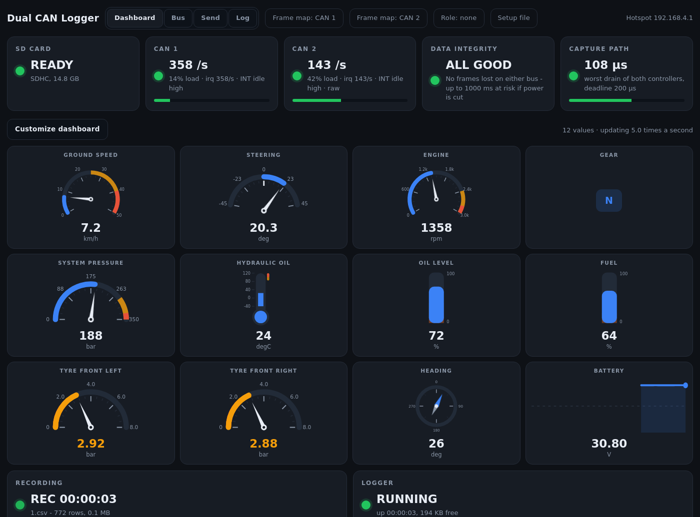

### The Dashboard

**Five health cards across the top**, all driven by measurements rather than
assumptions:

| Card | Shows | Turns red when |
|---|---|---|
| **SD Card** | type and capacity | no card, or a write failed |
| **Bus** | frames/s arriving | nothing has arrived for 500 ms |
| **Interrupt Path** | interrupts/s and the INT pin level | the ISR stops firing — see below |
| **Data Integrity** | frames lost this recording, and how much is at risk from a power cut | anything was lost, or nothing is arriving to check |
| **CAN Bus Load** | percent of the configured bit rate, with a meter | above 80 % (amber from 60 %) |

**Interrupt Path deserves its own card.** The MCP2515 holds two frames, and the
reader has a 20 ms fallback poll behind the interrupt. If the INT line ever
stops firing, the poll silently caps throughput at **~100 frames/s** — 50
wake-ups a second times two buffers — and *nothing else looks wrong*. The logger
keeps writing rows, just ninety percent fewer of them. This card is what makes
that visible instead of invisible.

**In the middle, whatever you decided matters** — a grid of gauges you lay out
yourself. See [Customizing it](#customizing-the-dashboard) below.

**Two control cards at the bottom** — Recording, with START/STOP and the current
file, rows and size; and Logger, with uptime, free memory and RESTART. They sit
below the data on purpose: the things you read constantly belong at the top, the
things you press occasionally at the bottom.

On a fresh logger the middle is empty and the tab is just health and controls,
which is a complete and useful dashboard on its own.

### Customizing the dashboard

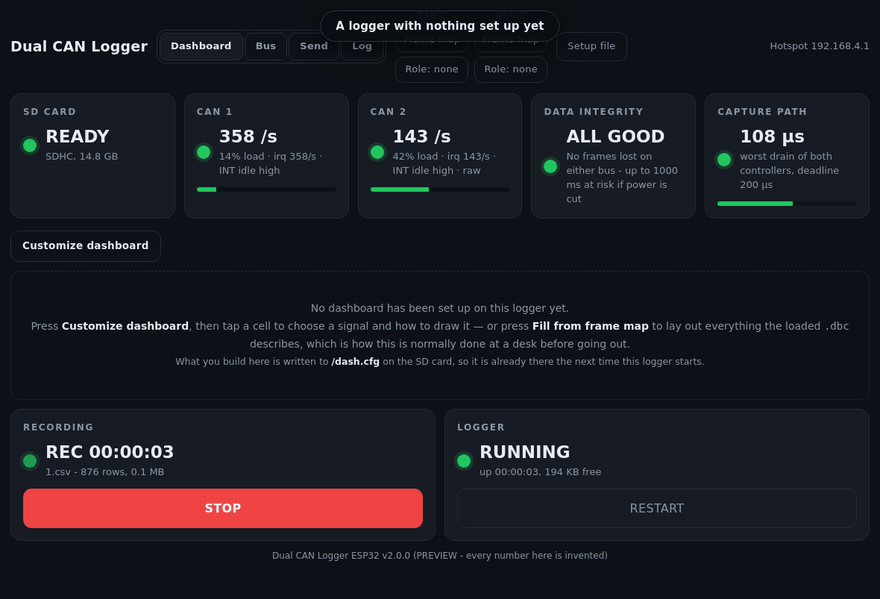

*A logger with nothing on its card, to a laid-out dashboard. Recorded from the
real page — the drag is a real pointer drag through the same handlers a finger
goes through.*

Press **Customize dashboard**. The grid becomes editable and a toolbar appears.

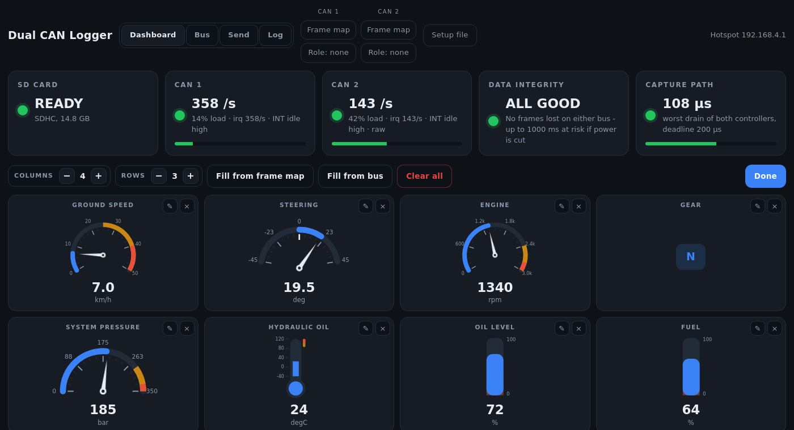

While the grid is in this state the fast poll drops to a two-second heartbeat —
the cells are placeholders being dragged around, so there is nothing live to
update and no reason to ask the logger five times a second.

Tap any cell to open the editor.

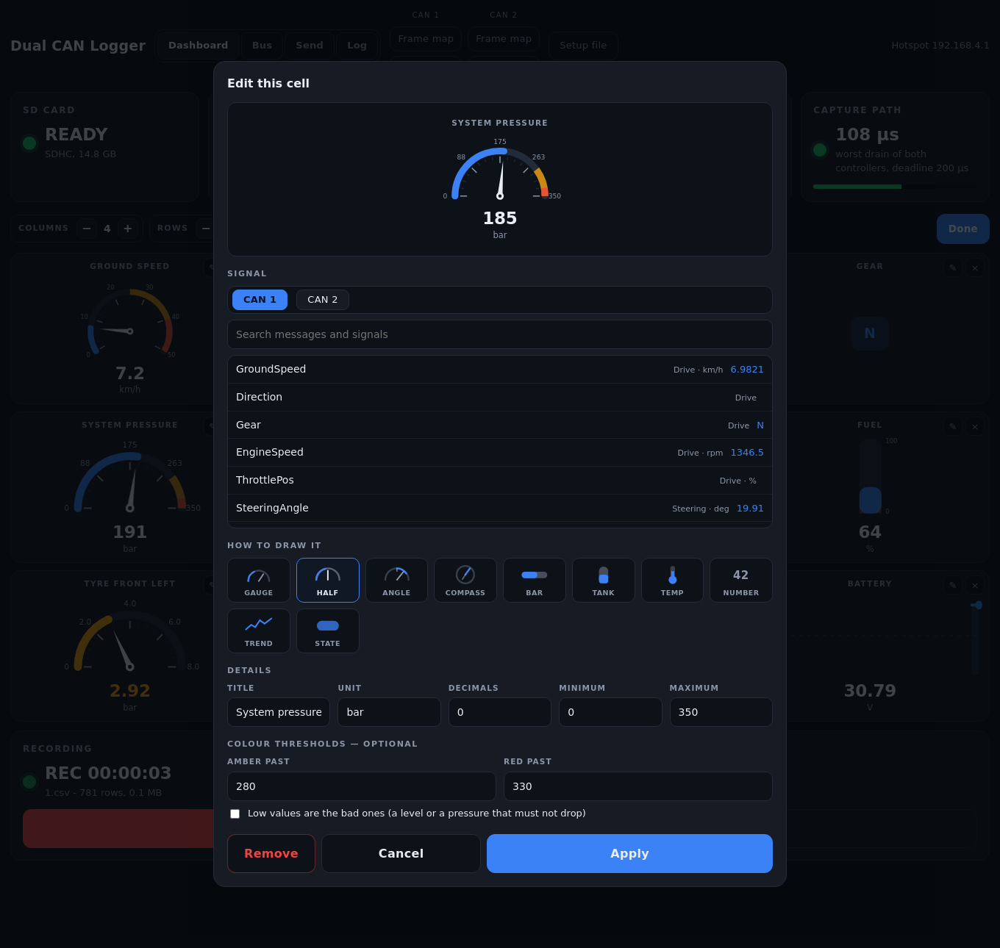

Choosing a signal fills in everything the frame map already knows — its unit,
its `[min|max]` range, and how many decimals its scaling factor actually
justifies — and suggests a shape from the unit and the name: `km/h` and `rpm`
get a dial, `deg` with a negative minimum gets a centre-zero indicator, `bar` a
half gauge, `degC` a thermometer, a signal with `VAL_` labels a state pill. All
of it is a suggestion you can override; none of it is a question you have to
answer.

The preview at the top is the **real widget fed the real live value**, so the
needle sits where it is going to sit.

| | |
|---|---|
| **Ten ways to draw a value** | dial (speed, rpm, flow) · half dial (pressure, load) · centre-zero angle (steering, tilt, articulation) · compass (heading, yaw) · bar (percentages) · tank (fuel, oil level) · thermometer · plain number · trend (a rolling trace) · state (a coloured pill showing a `VAL_` name) |
| **Arranging** | drag cells to swap them — pointer events, so it works with a finger as well as a mouse. Columns 1–6, rows 1–8, up to `DASH_MAX_CELLS` cells |
| **Colour** | optional amber and red thresholds, and a *low values are the bad ones* switch for a level or a pressure that must not drop |
| **Fill from frame map** | lays out everything the loaded `.dbc` describes, in file order, as far as the grid goes. Nothing has to be connected — this is the one to press at a desk, before going out |
| **Fill from bus** | the same list, but the signals *actually arriving* are placed first and the rest are capped. This is the one to press standing at the machine, because a grid full of cells that will never update is worse than a small one where everything moves |
| **Setup file** | export and import — see [The setup file](#the-setup-file) |

### Loading a frame map

**Frame map**, in the header, takes a `.dbc` off the phone or laptop you are
holding and puts it on the card as `/frames.dbc`. The map is rebuilt on the spot
— no reboot, no card reader, no laptop cable — and the dashboard re-binds to it
immediately, saying how many saved cells no longer match if any do not.

**Loading a map clears what the new one cannot account for.** A different frame
map means a different bus, so every cell and every sendable value naming a
signal the new file does not have is removed and the gaps closed. The role goes
the same way if the new file has no `BU_` node of that name — it is not merely
stale then, it is unanswerable, and the header would go on claiming a role while
both Fill buttons quietly stopped separating anything by it, so the question is
asked again. Load an unrelated `.dbc` and you get an empty setup, which is the
honest result; reload a corrected version of the same one and your layout
survives, because its signals are still there. One-off frames named by
identifier are never touched: they name no signal, so no frame map can
invalidate them.

The logger does the clearing and the page **re-reads** the result rather than
repeating it on its own copy. That is deliberate: two copies pruning themselves
independently is exactly how a browser holding the old layout gets to write it
back over a card that had just been cleaned.

This is not what happens at boot. There, a cell whose signal is missing is kept
and drawn as unresolvable — the usual reason is a card with no DBC on it, and
destroying a layout built at a desk because the card was in the other pocket
would be unforgivable.

It is streamed to the card a chunk at a time rather than held in memory: a real
machine's `.dbc` runs to ninety kilobytes, which is more than the frame map
built from it and a third of this chip's free heap. It lands on a temporary name
and is renamed into place only once the whole file has arrived, so a Wi-Fi
dropout mid-upload costs you the upload and not the map you were already using.

**Refused while a recording is running**, deliberately. Every CSV opens with a
header naming the exact map its rows were decoded through; swapping the map
underneath a file in progress would make that header a lie for every row after
the swap. Stop, load, start.

### Which node this logger is

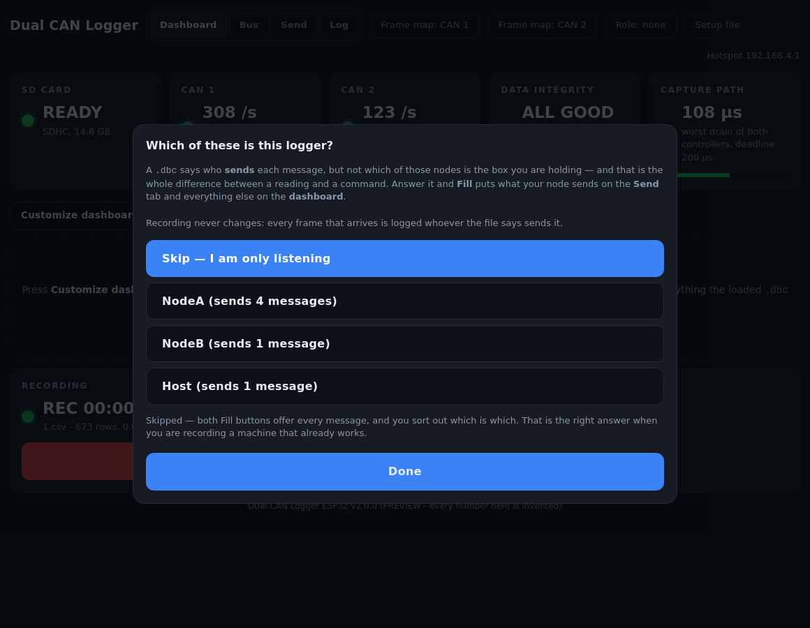

A `.dbc` says who **sends** each message. It does not say which of those nodes
is the box in your hand — and that one missing fact is the whole difference
between a reading and a command:

```
BO_ 768 ABS_LeftEncoder: 8 ABS_ECU     the ECU sends it   -> a reading
BO_ 800 ABS_Cmd:         8 Tester      the tester sends it -> a command
```

Answer it and **Fill from frame map** puts what your node sends on the **Send**
tab and everything else on the dashboard. The answer lives on the **Role**
button in the header — visible from every tab, because a wrong answer does not
announce itself, it just fills the wrong half of the map into the wrong screen.
It opens by itself the first time after you load a frame map, which is the
moment it is worth answering and the only moment it costs nothing.

**Skip is a real answer, and usually the right one.** On a machine that already
works, none of the nodes in the file is you — you are a bystander with a clip
lead. Skipping means both Fill buttons offer everything and you sort out which
is which, exactly as they behave with no frame map at all.

Nothing about recording changes either way: every frame that arrives is logged
whoever the file says sends it, and a frame you send is built from the frame map
alone. The role is an authoring aid, and the firmware never filters on it.

### The setup file

Everything customized on a logger — the dashboard cells **and** the values that
can be sent — is one file. So there is **one** Export and **one** Import, in the
header, on every tab, behind **Setup file**.

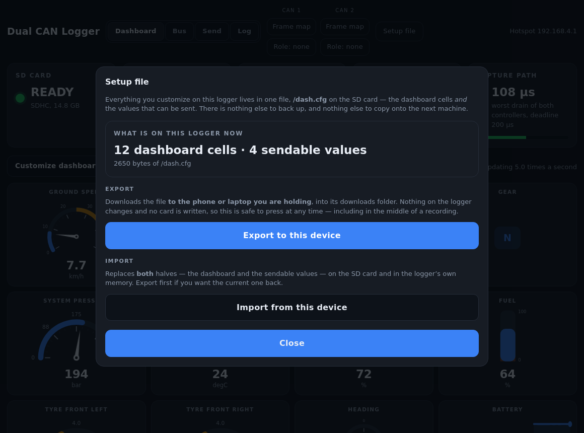

**Export downloads to the device in your hand**, into its downloads folder.
Nothing on the logger changes and no card is written, so it is safe to press
mid-recording. **Import replaces both halves at once**, on the card and in the
logger's own memory.

That is the whole sheet: what is on the logger now, Export, Import.

Two copies, one rule — because this is set up **at a desk, before you go out**,
and has to be there when you arrive.

```
/dash.cfg on the SD card        the copy you can edit in any text editor,
                                keep in version control, and copy between
                                loggers. See examples/dash.cfg.

NVS in the ESP32's own flash    survives a card swap, a reformat, and
                                running with no card at all.
```

At boot the logger compares `/dash.cfg` against a hash of the text it last
agreed with:

- **hashes match** → nobody touched the card; the flash copy wins, which is
  what preserves anything saved from the browser since the last boot
- **hashes differ** → somebody edited the file; the card wins
- **no file on the card** → the flash copy is written out to it, which is how
  the file comes into existence
- **nothing anywhere** → an empty grid, and the page says so

The effect is the one people expect: *whichever you edited last is the one you
get.* Saving in the browser writes the card immediately, through the task that
owns it; the flash copy is written when no recording is running, because writing
NVS stops the flash cache and the CAN interrupt is reached through a dispatcher
that may not be resident in IRAM. Losing power in between costs nothing — the
card is correct and the boot rule imports it.

### The Bus tab

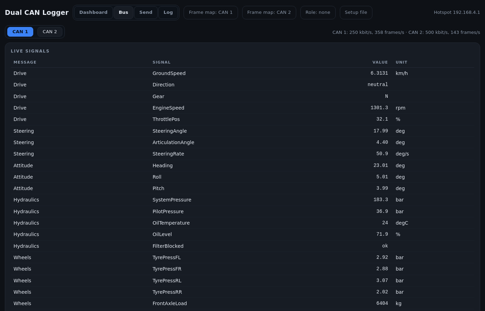

**Live Signals** — every signal the frame map describes, with its current value
and unit. **Identifiers on the wire** — every id seen since the recording
started, its most recent payload, frame count, rate, and whether the frame map
describes it. This is the tab for building a frame map, and the one to look at
when a dashboard cell says a signal is missing.

### With no frame map

Without a DBC the page does not pretend: there are no named signals to put on a
dashboard, the Bus tab becomes the live view showing raw payloads as they
change, and the Dashboard is health and controls.

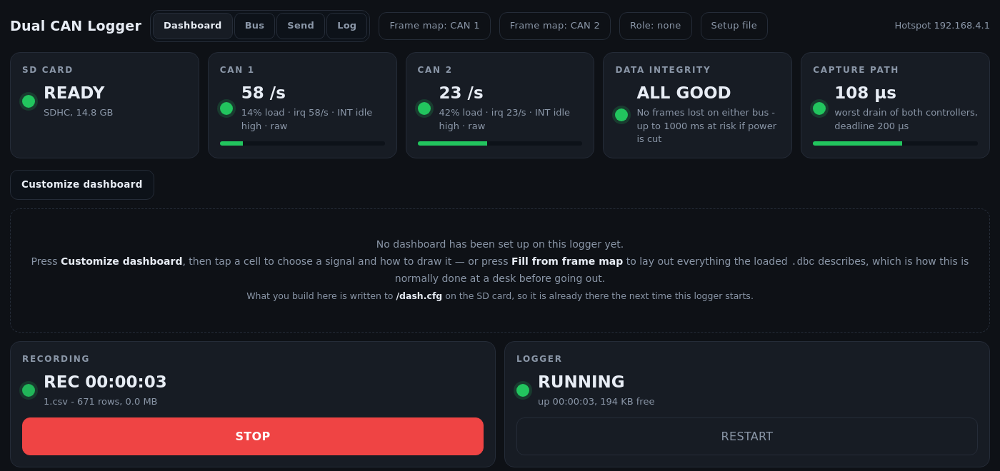

Like the firmware, the page names nothing of its own. Every widget, every unit
and every range comes from the file on the card. Nothing about the page changes
when you swap buses — only that file does.

### Preview it with no hardware

```bash
# the real page, against simulated data - opens on http://127.0.0.1:8080.
# Starts from examples/machine.dbc and a COPY of examples/dash.cfg, so there is
# a dashboard and a set of sendable values to look at from the first second.
python3 tools/preview_dashboard.py

# keep the changes: write them back to the example itself
python3 tools/preview_dashboard.py --cfg examples/dash.cfg

# a logger with nothing on its card, which is a different page
python3 tools/preview_dashboard.py --empty --no-dbc
```

It prints what it loaded — `setup: 12 dashboard cells, 4 sendable values` — so an
empty page is never a mystery.

### Setting it up for your own bus, at a desk

No logger, no wiring, no traffic. All you need is your `.dbc` and Python.

```bash
python3 customize.py                                   # load the .dbc in the page
python3 customize.py path/to/mine.dbc                  # or start with it
python3 customize.py path/to/mine.dbc --role Tester    # if one of them is you
```

**It never asks a question in the terminal.** With no argument the page opens
empty and its own **Frame map** button loads a `.dbc` from wherever you keep it
— the same button the logger itself has, so there is one way to do this rather
than two.

or **double-click `customize.py`** and pick your file — from the list it finds,
or press **b** to open your computer's own file browser. On Windows,
`customize.bat` does the same and you can drag a `.dbc` straight onto it.
`--browse` goes straight to the file dialog.

That one command:

- checks the file against the limits this firmware was built with, and says what
  it could not read
- picks a free port, starts the page and opens your browser at it
- writes everything you build into `mine.cfg`, next to your `.dbc`, as you go

**One setup per frame map, always.** The `.cfg` is named after the `.dbc` and
sits beside it — and when the map came from the page rather than the command
line, beside `customize.py`. So starting with no frame map starts *empty*, and
loading a map opens that map's own setup: yesterday's work on another bus can
neither appear as a screen of `unknown` cells nor be written over. Load a second
map in the same session and the same rule applies — the first map's file is left
exactly as it was.

Then, in the page:

**1. Load your frame map** if you did not name one on the command line —
*Frame map*, in the header.

**2. Say which node you are** — or skip. *Role*, in the header. See [which node
this logger is](#which-node-this-logger-is); `--role` above answers it before
the page opens, and the button changes it afterwards. Skip if you are only
listening, and both Fill buttons will offer everything.

**3. Build the dashboard.** *Customize dashboard* → **Fill from frame map**. Every
signal becomes a cell, drawn as its unit and name suggest. Delete what you do not
want, drag the rest into order, tap any cell to change the shape, the range or the
thresholds. Removing one closes the gap. The values moving on them are invented —
the point is the layout.

**4. Build the sendable values.** Send tab → *Set up sendable values* → **Fill from
the frame map**, and pick the message your controller takes its settings from.
Then fix the inputs: the one that should be a list of four tyre sizes becomes
*Pick from a list I write*.

**5. Take it with you.** Copy two files to the root of the SD card:

```
mine.dbc   ->  /frames.dbc
mine.cfg   ->  /dash.cfg
```

Power the logger up and it opens on your dashboard, with your sendable values,
having never been connected to a bus during any of it.

#### Checking a frame map on its own

```bash
python3 tools/check_dbc.py path/to/mine.dbc          # counts, limits, direction
python3 tools/check_dbc.py path/to/mine.dbc --list   # every message and signal
```

It names the lines it could not read, warns if the file overruns
`DBC_MAX_MESSAGES` / `DBC_MAX_SIGNALS` / `DBC_MAX_VALDESC`, flags definition
lines longer than `DBC_LINE_MAX` (which lose everything past the cut), and prints
**who sends what** and which messages are multiplexed.

It is pure Python — no compiler, no shell — which means it is a *second*
implementation of `src/dbc.cpp` and would normally be a reason to distrust it.
So `test/run_tests.sh` compiles the real parser and asserts the two agree,
message for message and signal for signal, on every frame map in `examples/`.
That test has already earned its place: it caught the Python reader reading a
factor of `1e-06` as zero decimal places, which would have shown different
digits at a desk than in the field.

The page is extracted straight out of `src/webpage.cpp` on every request, so the
preview can never drift from what the firmware serves, and editing the page and
pressing refresh just works. **The data is invented** — the point of the tool is
the interface, not the numbers. Layout changes are kept in memory and written
back to `--cfg` if one is given, so a dashboard worked out here can be copied
straight to the SD card.

**The invented values follow the range you give a cell.** Narrow a gauge from
`[0|4294967295]` down to 88–92 — the useful band around a steering-angle filter
where 90 is straight — and the needle sweeps 88 to 92, instead of sitting pegged
at the top of a scale nothing will ever reach. The value is remapped from the
range the frame map declares into the range you chose, so it is the same motion
expressed in your scale, and the Bus tab agrees with the dashboard about where
the signal is running.

The screenshots above are generated from it:

```bash
python3 tools/capture_screenshots.py     # regenerates docs/img/*.png
python3 tools/capture_gifs.py            # regenerates the two walkthroughs
```

Re-run that after changing the page, or this section will document a dashboard
that no longer exists.

### Why plain polling

It is a plain `WebServer` with polling rather than an async server with
websockets, on purpose: no third-party libraries, so the PlatformIO and Arduino
IDE builds are the same code with no install steps. The HTTP handler runs at the
lowest priority and never touches the SD card or the CAN controller, so a
browser hitting refresh cannot perturb a recording.

The dashboard's request carries only the cells that exist, as text the decode
task had already rendered — so the fast path copies strings and does no
decoding, no formatting and no floating point. The two expensive tables live on
the Bus tab, and are built only when that tab is open.

The page itself is ~122 KB of HTML, CSS and hand-drawn SVG in one document with
no external assets, streamed from flash to the socket a chunk at a time so it is
never assembled in RAM. It has to load from a hotspot with no route anywhere,
which rules out every CDN and therefore every gauge library there is.

---

## 7. Sending values back to the bus

> **Read this before enabling it on a machine.** A CAN frame sent to a live
> controller can move hydraulics, release a brake or enable a drive. The logger
> sends what it is told and cannot know which. Everything below is about making
> that deliberate rather than easy.

Everything else in this firmware listens. This is the one part that talks: it
writes a value into an ECU — a tyre size, a limit, a calibration offset — **while
a recording is running**, so the change and its effect land in the same file.

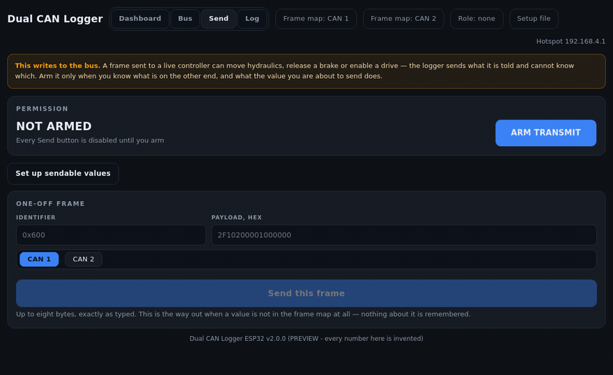

*Saying which node the logger is, filling the sendable values from the frame map
— only what that node sends — arming, and sending. The frame it writes carries
`Command = 32` because the `.dbc` says that is the opcode `WheelDia_mm` belongs
to.*

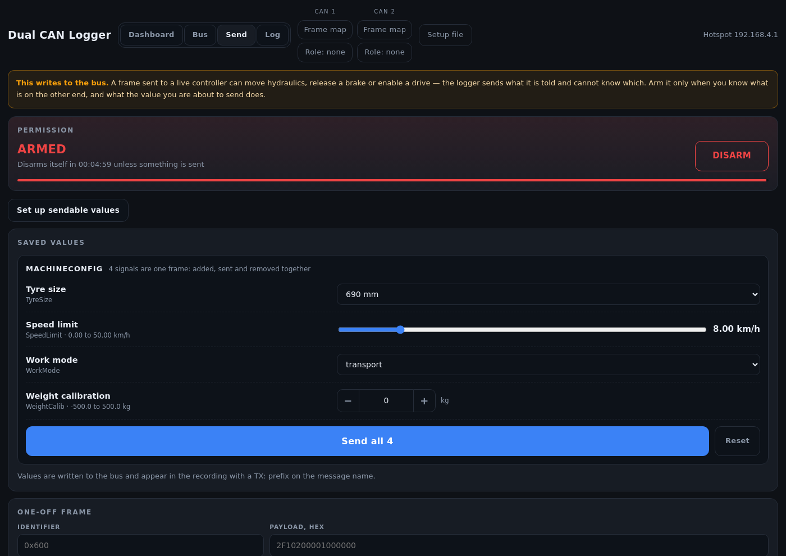

### Set the values up first, use them in the field

The whole point is that nobody types a number next to a running machine. At the
desk, press **Set up sendable values**.

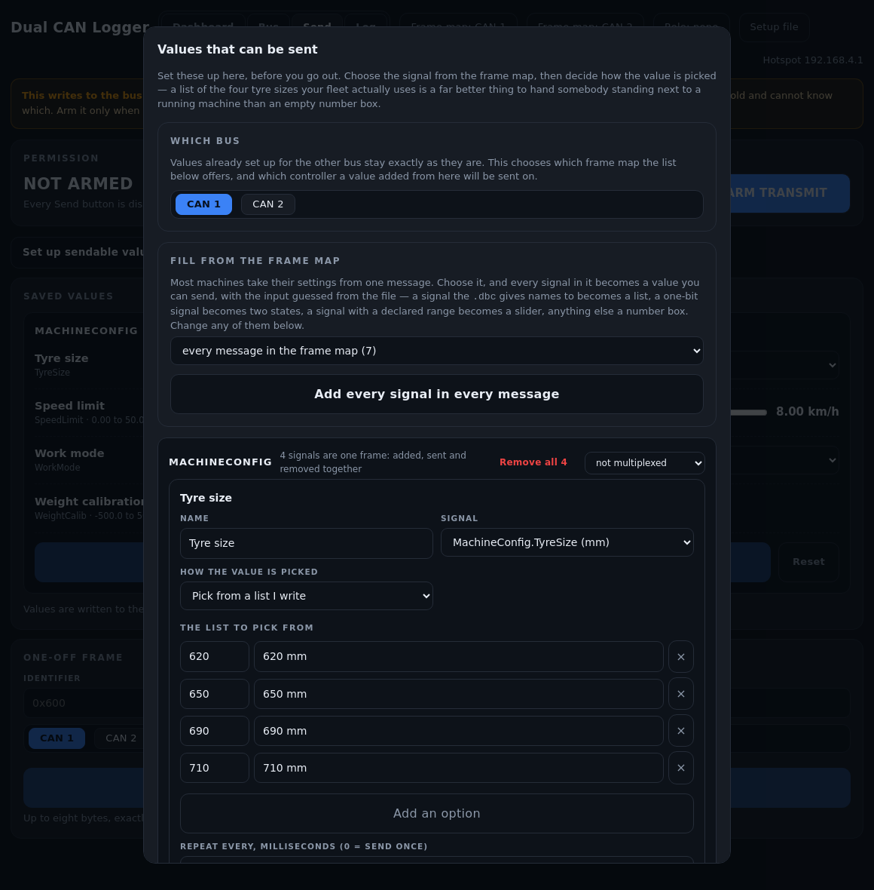

Start with **Fill from the frame map**. Choose one message — or
**every message this logger sends**, which is usually what you want, since a bus
has one or two command frames and no reason to add them one at a time. Every
signal in them becomes a value you can send, with the input guessed from the file — a signal with `VAL_` names
becomes a list, a one-bit signal becomes two states, a signal with a declared
range becomes a slider, anything else a number box. On
[`examples/machine.dbc`](examples/machine.dbc) that turns `MachineConfig` into
its four signals in one press.

Then adjust each one: which signal it writes, and *how the value is picked*.

| Input | For |
|---|---|
| **Pick from a list I write** | a tyre size that is one of the four your fleet uses; a gear ratio; anything with a small set of right answers |
| **Pick from the frame map's own names** | a signal with `VAL_` labels — the list comes from the DBC, so it cannot disagree with it |
| **Two states** | an enable, a mode flag, anything boolean, with your own labels rather than 0 and 1 |
| **Slider** | a continuous limit, stopping exactly where the signal does |
| **Type a number** | the fallback, not the default |

Ranges come from the frame map, and are then **cut to what the bits can actually
hold**: a 16-bit signal at factor 1 cannot carry 99999 however the file is
annotated, and a slider that goes further than the wire does would aim the
operator at a value that is silently clamped on the way out.

These live in the same `/dash.cfg` as the dashboard, so they travel with it.
[`examples/dash.cfg`](examples/dash.cfg) sets up four against
[`examples/machine.dbc`](examples/machine.dbc), including the tyre size:

```
send 0 label="Tyre size" sig=MachineConfig.TyreSize unit=mm lo=400 hi=1400 \
       preset=690 style=choice choices="620:620 mm|650:650 mm|690:690 mm|710:710 mm"
```

On the machine, the Send tab is then just: arm, pick, press.

### Frames that only mean anything whole

A value is not always a frame. Two cases need the whole frame sent at once, and
both are read out of the DBC rather than left to be remembered.

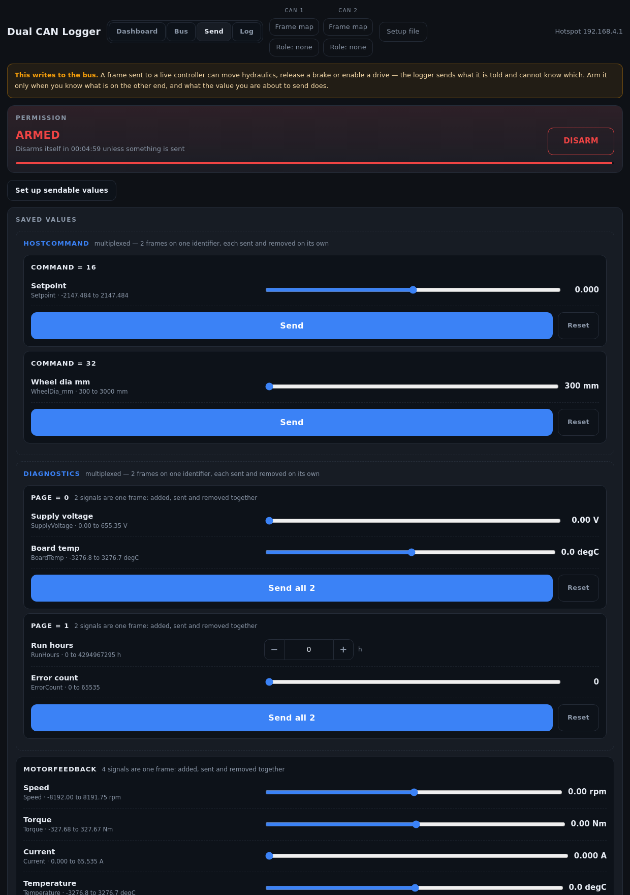

**Multiplexed commands.** A command frame often carries an opcode and a payload
whose meaning depends on it:

```
BO_ 288 HostCommand: 8 Host
 SG_ Command M         : 0|8@1+  ...     the selector
 SG_ WheelDia_mm m32   : 8|16@1+ ...     only means "wheel diameter" under op 32
```

Writing `WheelDia_mm` on its own arrives as opcode 0 and is thrown away.
So the logger **writes the selector automatically**, with the code the frame map
says belongs to the signal being sent — inserted as raw bits, because a mux code
is a bit pattern by definition and has no scaling of its own. The selector is not
offered as a value to set up, because it is not a decision anybody should have to
get right twice; the row that needs it just says *sent with Command = 32*.

That example is in [`examples/example.dbc`](examples/example.dbc), and
`test_encode.cpp` builds the frame from it and reads it back.

A multiplexed frame is also the one case where the payload is **not** seeded from
what the bus last said. The bytes mean different things on different pages, so
carrying a previous page's bytes forward would send garbage under a new opcode.

**The payloads of one multiplexed frame are kept as a set.** Filling adds all of
them; removing any one removes all of them; and choosing one by hand brings the
rest with it. Keeping two of five is keeping a half-described command — the
operator sees *wheel diameter* and *amplitude* with no way to tell that three
other opcodes exist. The setup sheet says so on each card, and the button reads
**Remove all 6** rather than **Remove**.

**Signals that are read as a set.** A plain message with several signals is one
frame whichever signal you meant to change, so *Fill from the frame map* groups
them: one box, one **Send all**, one frame. Behind it, the members are queued
back to back with every one but the last held — each writes into the frame under
construction and only the last transmits. The queue is drained by a single task,
so nothing can slip in and split the group.

Grouping is a `group=<n>` on the `send` lines, and any value can be pulled out of
its group or put back in the setup sheet.

### Arming

Every Send button is dead until you press **ARM TRANSMIT**, and the logger
disarms itself again after `TX_ARM_TIMEOUT_MS` (five minutes) without a send.

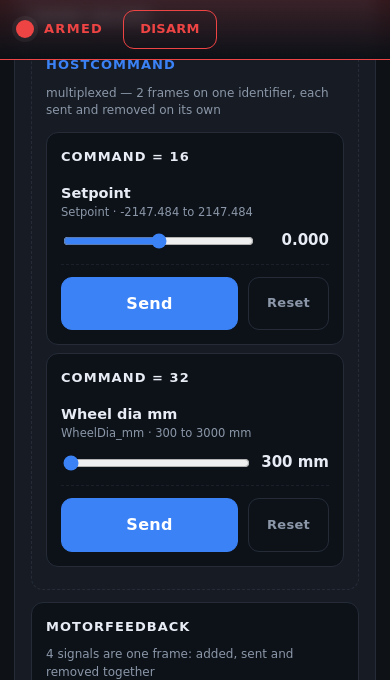

Once the permission card scrolls away, a compact copy pins itself to the top of
the screen, so **DISARM is always one press** however long the list of values is.
It is fixed to the viewport rather than sticky in the flow, so nothing moves
when it appears — which matters, because it appears while somebody is reaching
for a Send button.

This is not security — anyone on the hotspot can arm it. It is what stops a
stray tap, a bookmarked page, or a browser restoring its tabs from sending a
command nobody meant to send. It expires by itself because a gate that stays
open is not a gate. Arming, disarming and every frame sent are written to the
recording's `.log`.

The gate is enforced **where the sending happens**, not in the browser and not
in the HTTP handler: a repeating value stops the moment the gate closes.

### What ends up in the recording

An MCP2515 does not hear its own transmissions, so a frame the dashboard sent
would otherwise be missing from the very file it was sent during — and a
setpoint whose effect you can see but whose cause you cannot is worse than
useless. Sent frames are therefore fed back into the recording, decoded the same
way as everything else, with the message name prefixed:

```
t_us;id;name;signal;value;unit;raw
1042318;0x110;TX:MachineConfig;TyreSize;690;mm;
1042994;0x100;Drive;GroundSpeed;12.4;km/h;
```

**The seven-column schema is unchanged.** Nothing that predates this feature
breaks; a reader that does not know about the prefix simply sees a message
called `TX:MachineConfig`. `tools/parse_log.py` does know about it — it reports
sent frames separately, marks them in `--list`, and groups them with the signal
they wrote in `--wide` rather than making a second, nearly-empty column.

### What happens on the wire

`MCP2515::sendFrame()` puts the controller in **one-shot mode**, which is not
the obvious choice and is the important one.

Left to itself an MCP2515 retries an unacknowledged frame forever, and each
failed attempt adds 8 to the transmit error counter. At 250 kbit/s, a frame sent
to an ECU that is not there drives TEC from 0 to 255 in about **30 milliseconds**
and the controller goes **bus-off** — which stops it *receiving* too. A logger
that goes deaf because somebody pressed Send on a disconnected bus is a worse
logger than one that cannot send at all.

One-shot attempts the frame once, so TEC moves by 8 and the failure is reported
instead of escalating. Losing arbitration is retried in software up to
`TX_ATTEMPTS` times, because on a busy bus that is normal and is not a failure.
The answer comes back as one of:

| | |
|---|---|
| **sent and acknowledged** | at least one other node ACKed it, and TEC went *down* — which is the independent evidence, not just a status bit |
| **nothing on the bus acknowledged it** | the ACK slot stayed empty. The most common reason a Send does not work, so it gets its own answer rather than a generic bus error |
| **the bus was too busy to get on** | lost arbitration every attempt |
| **listen-only mode** | `CAN_LISTEN_ONLY` is set, so the logger physically cannot drive the bus. Said out loud, rather than failing quietly |

### Encoding

A value is placed into its message by `dbcEncodeSignal()`, written as the mirror
image of the decoder and reusing its bit walk, so `decode(encode(x)) == x` for
every signal the logger can read. `test/test_encode.cpp` asserts exactly that by
sweeping **every raw value** each signal can hold — a few thousand per run — and
comparing the payload byte for byte. A transmit path that is subtly not the
inverse of the receive path is the kind of bug that shows up as a machine doing
the wrong thing, not as a wrong number on a screen.

Two details that matter:

- **The message's other signals are preserved.** The payload starts as the last
  thing the bus said that message contained, and only the target signal's bits
  are changed. Zeroing the rest would command every other signal in the message
  to zero as a side effect of setting one.
- **Out of range clamps, and says so.** Wrapping 70000 mm into 16 bits would put
  4464 mm on the wire and nobody would ever know.

### Turning it off entirely

Set `CAN_LISTEN_ONLY` to `1` in `src/config.h`. The controller then physically
cannot drive the bus, and the Send tab says so instead of appearing to work.
That is the right setting for a logger left on a machine you do not own.

---

## 8. Why it does not lose frames

This is the part worth copying if you build something else.

A busy 250 kbit/s bus delivers on the order of 1000 frames/s and **the MCP2515
holds exactly two**. That is roughly 2 ms of slack, against SD block writes that
can stall for 100 ms on a bad card. Polling cannot bridge that gap. Neither can
"do the work in the interrupt" — an SPI transaction can block, and blocking in an
interrupt handler is how frames get lost.

So the interrupt does the **minimum bounded work** and nothing else:

| Stage | Who | What, and why |
|---|---|---|
| INT falls | `canIsr`, in IRAM | Takes the arrival timestamp with `esp_timer_get_time()` and pushes it into a small ring, then unblocks the reader task. **No SPI, no allocation, no file I/O, no logging.** The work is constant regardless of what the bus is doing. |
| drain | CAN task, prio 20 | Empties *both* receive buffers over SPI and keeps going until the controller reports empty — that is what makes the edge-triggered INT safe when a second frame arrives while INT is still low. A 20 ms timeout re-drains unconditionally, so even a completely missed edge costs latency, never data. |
| buffer | 1024-frame queue | 24 KB = one full second of slack in front of the SD card. |
| decode + write | writer task, prio 10 | Looks the id up in the frame map, decodes each signal, formats CSV, fills an 8 KB block, writes it. While blocked in that write the reader simply preempts it. |
| Wi-Fi / HTTP | core 0 and `loop()` | Lowest priority, on the other core. Cannot interfere with either. |

The timestamp is taken **in the ISR**, before any queuing or scheduling delay can
smear it — which is why `t_us` is trustworthy even when the writer is 200 ms
behind. Everything expensive (DBC lookup, bit extraction, scaling, decimal
formatting, SD I/O) happens on the far side of the queue, where being slow costs
queue depth instead of frames.

Both remaining loss points are **counted and reported**: the controller's own
overflow flags (stage 1→2) and the queue-full counter (stage 2→3). A recording
that ends with `lost 0` is provably complete — that is what the *Data Integrity*
card shows.

**A non-zero figure is a floor, and says so.** The queue-full counter is exact:
it counts frames. The controller's overflow flags are not — `EFLG` carries one
sticky bit per receive buffer, so a service pass that finds them set knows *that*
frames were lost, never how many. So the page reads `≥ 412 LOST`, and the log
separates `ovfEvents` from `ovfFrames>=`.

That distinction was worth drawing. The counter used to be incremented once per
service pass, which in a fault that pinned the receiver made `lost` converge on
a flat ~51/s — a poll rate wearing a loss figure's clothes. Checked against the
4-bit rolling counters the bus itself carries, the true loss in three affected
recordings was roughly **1.7× what was reported**.

*(Those figures come from field recordings measured with tooling outside this
repository. They are the reason for the change, not something a clone can
re-check — unlike every number under [Verification
status](#13-verification-status), which is.)*

| recording | reported | actual, from rolling counters |
|---|---|---|
| A | 265 983 | 456 814 |
| B | 271 305 | 478 986 |
| C | 28 038 | 48 845 |

The floor it now reports is still below the truth. It is at least honest about
which direction it is wrong in.

---

## 9. Surviving a power cut

Two different things have to reach the card, and only the second one makes a
recording readable again:

1. the rows still in the **RAM block buffer** (8 KB);
2. the **FAT and directory entry**, which is what records the file's new
   *length*. Bytes handed to `write()` may already be physically on the card, but
   until the metadata is committed the file still reports its old size, and a
   remount truncates everything written since.

Point 2 is the one that catches people out: the exposure window is set by
`SD_SYNC_INTERVAL_MS`, **not** by the buffer size.

| | Worst-case loss |
|---|---|
| Default, no extra hardware | **≤ 1 s** (`SD_SYNC_INTERVAL_MS`) |
| With the power-fail input wired | **0** — files are flushed and closed before the capacitor runs out |

A sync rewrites 2–3 sectors; at 1 Hz that is well under 1 % duty and the frame
queue absorbs it completely. The CSV header is committed immediately at start, so
even a recording cut short a moment later leaves a valid, self-describing file.
Measured sync cost and the current exposure window are reported once per second
into `N.log`:

```
health: ... syncs=142 maxSync=8113 us atRisk<=340 ms ...
```

### Getting to zero

Set `PIN_POWER_FAIL` in `src/config.h` (default `-1`, disabled) and wire:

- the logger fed from a **bulk capacitor behind a diode**, so it keeps running
  briefly after the supply drops;
- a **divided copy of the upstream supply** into `PIN_POWER_FAIL`.

When the supply collapses the pin changes state while the capacitor still holds
the ESP32 up. The ISR only raises a flag — opening, flushing and closing files
are all forbidden from an ISR — and the writer task, which checks that flag
before anything else on every pass (≤ 20 ms), flushes the buffer, commits the
metadata and closes both files.

Sizing: the emergency close wants ~50 ms. Holding 150 mA for 50 ms across a
5 V → 3.6 V droop needs `C = I·t/ΔV = 0.15·0.05/1.4 ≈ 5400 µF`, so a
**6800 µF / 10 V** electrolytic is a sensible choice.

After a power-fail close the logger does **not** silently reopen — that would
hide the event and produce a second file with its first rows missing. The
dashboard shows **POWER LOSS** in red until someone presses START.

Leave `PIN_POWER_FAIL` at `-1` if you have no such circuit: an unconnected pin
would float and fire spuriously.

---

## 10. Host-side tools

Standard library only, except the plotter and the GIF recorder (`matplotlib`
and `websocket-client`). **All of them are Python**, so they
run the same on Windows, macOS and Linux with nothing installed — that is why
there are no shell scripts here. (`test/run_tests.sh` and `arduino/sync.sh` are
for contributors on Unix; the Arduino sketch folder has `arduino\sync.bat` for
Windows.)

```bash
# lay the dashboard and the sendable values out for your own bus, at a desk.
# Double-clickable; on Windows use customize.bat, or drag a .dbc onto it
python3 customize.py path/to/mine.dbc

# will this frame map load on the logger?
python3 tools/check_dbc.py path/to/mine.dbc --list
```

```bash
# summary, per-id rates, and an integrity check
python3 tools/parse_log.py 1.csv

# which signals are in this recording
python3 tools/parse_log.py 1.csv --list

# pivot the long form to one column per signal, for pandas/Excel
python3 tools/parse_log.py 1.csv --wide wide.csv

# plot (needs matplotlib); signals sharing a unit share an axis
python3 tools/plot_log.py 1.csv 'MotorFeedback.*' -o out.png

# the same page directly, when you want the arguments rather than the prompts
python3 tools/preview_dashboard.py --dbc examples/example.dbc --cfg mine.cfg

# when a board will not enter download mode - see WINDOWS.md
python tools/esp32_reset_probe.py COM3
```

### Tests

```bash
./test/run_tests.sh
```

Compiles the **real** sources from `src/` against small shims in `test/shim/`
and runs them natively — the DBC parser (Intel and Motorola layouts, signed
values, factors and offsets, value tables, multiplexing, IEEE floats, counter
unwrapping, malformed input, table overflow), the CSV schema in both modes, the
CANopen framing layer, and the logger. Also type-checks every module under
`-Wall -Wextra`, parses `examples/example.dbc`, checks that every DOM id and
status field the dashboard's JavaScript touches actually exists, and verifies
the Arduino sketch generator.

The shims are not the real Arduino/ESP-IDF APIs, so they cannot catch an SDK
signature mismatch — only a real `pio run` does that, which is why CI does both.

> `test/shim/Arduino.h` deliberately reproduces the Arduino core's **object-like
> macros** (`HEX`, `DEC`, `BIN`, `PI`, `bit()`, `sq()`, …). Do not remove them to
> tidy up. A shim that omits them compiles code the real toolchain rejects, with
> errors that point nowhere near the cause — a `static const char HEX[]` array
> becomes `static const char 16[]`.

---

## 11. Tuning

All in `src/config.h`:

| Setting | Default | |
|---|---|---|
| `CAN_BITRATE_KBPS` | 250 | 100 / 125 / 250 / 500 / 1000 |
| `CAN_CRYSTAL_MHZ` | 8 | Must match your MCP2515 board |
| `CAN_LISTEN_ONLY` | 0 | 1 = never drive the bus |
| `DBC_PATH` | `/frames.dbc` | Where the frame map lives |
| `DBC_MAX_MESSAGES` / `DBC_MAX_SIGNALS` | 256 / 1024 | Ceilings; the tables are sized to your file |
| `DBC_HEAP_RESERVE` | 90 KB | Heap the frame map will not take, so Wi-Fi still starts |
| `CANOPEN_DECODE` | 0 | Label unmapped ids CANopen-style |
| `CSV_INCLUDE_RAW` | 0 | Keep the payload on decoded frames too |
| `SD_BLOCK_BYTES` | 8192 | Bytes per SD write |
| `SD_SYNC_INTERVAL_MS` | 1000 | The power-cut exposure window |
| `PIN_POWER_FAIL` | -1 | See §8 |
| `FRAME_QUEUE_LEN` | 1024 | One second of slack |
| `BUS_TRACK_IDS` / `WEB_MAX_SIGNALS` | 24 / 48 | Dashboard table sizes |
| `AUTO_START_RECORDING` | 1 | Record from power-on |
| `ENABLE_OTA` | 1 | Wi-Fi flashing |

Plus the pin map, task priorities and cores, and the Wi-Fi fallbacks.

---

## 12. Troubleshooting

<details>
<summary><i>expand</i></summary>
<br>


| Symptom | Cause |
|---|---|
| `CAN CONTROLLER NOT RESPONDING` | MCP2515 wiring or power. The driver verifies the SPI link both ways at boot, so this means CS, MISO/MOSI or 3V3 is wrong. |
| `NO CAN TRAFFIC`, bus is fine | Wrong `CAN_CRYSTAL_MHZ` (8 vs 16), wrong bit rate, or CAN_H/CAN_L swapped. |
| Everything logs as raw bytes | No `/frames.dbc` on the card, or it has no `BO_` lines. The boot log says which. |
| One message logs as raw, the rest decode | Its identifier is not in the DBC — or it is, but with the 29-bit flag set/unset differently. |
| `N line(s) of /frames.dbc could not be parsed` | Check the `.log` file. Interleaved `SG_` blocks and unsupported constructs are the usual causes. |
| Values look scaled wrong | Factor, offset or start bit in the DBC. Set `CSV_INCLUDE_RAW = 1` and check the payload against the decoded value. |
| `the frame map did NOT fit` | It says what it kept. Either the file passed a ceiling in `config.h`, or it wanted more heap than `DBC_HEAP_RESERVE` leaves. Frames beyond it are still recorded, as raw bytes. |
| `lost` climbing | Slow SD card. Use a decent class-10, raise `SD_BLOCK_BYTES`, or check `maxWr` in `N.log`. |
| Last seconds missing after a power cut | Expected without the power-fail input — see §8. If `maxSync` is large the card is slow at committing metadata. |
| File exists but has only the header | Power was cut in the first second. The header is committed at start, so this is the floor, not corruption. |
| The other node goes error-passive | `CAN_LISTEN_ONLY = 1` with nothing else on the bus to ACK. |
| `NO SD CARD at any clock ...` | First suspect **power**: most modules need 5V on VIN, not 3V3. Then: card must be FAT32 (cards over 32 GB often ship as exFAT), and CS=D4, SCK=D14, MISO=D27, MOSI=D13. |
| `SD card needed a slower clock` | Not an error — it mounted, just below `SD_SPI_HZ`. Long jumpers, a cheap adapter or a ribbon to a panel-mounted slot. Shorten the wiring if `lost` climbs; otherwise ignore it. |
| Dashboard unreachable | Check `mode` in `/config.txt`; on `sta` failure it falls back to the `CAN-Logger` hotspot. |
| `Wrong boot mode detected (0x13)` | Flashing, not running — see [WINDOWS.md](WINDOWS.md). |

---

---

</details>

## 13. Verification status

<details>
<summary><i>expand</i></summary>
<br>


Being straight about what has and has not been proven.

**Verified — the firmware compiles for real ESP32 hardware.**
`pio run -e esp32dev` against espressif32 7.0.1 / arduino-esp32 3.20017 /
xtensa-gcc 8.4.0 links a complete image, with **no warnings** from any of the ten
translation units under `-Wall -Wextra`:

```
RAM:   [==        ]  24.9% (used 81496 bytes from 327680 bytes)
Flash: [======    ]  55.3% (used 1086745 bytes from 1966080 bytes)
```

Flash sits at 55 % of one 1.9 MB app slot, so the OTA partition scheme still has
ample room; the web page accounts for about 122 KB of it. That RAM figure is **static** memory, which is the one with a hard ceiling. It
holds the 24 KB frame queue and the 13 KB CSV staging buffer; the frame map, the
live values and the saved dashboard are all on the heap and sized to what is
actually loaded.

**Static RAM is the binding constraint on this chip, not flash.** That is not a
guess: the first build of the dashboard overflowed `dram0_0_seg` by 2248 bytes,
and `DASH_MAX_CELLS` and `TX_MAX_COMMANDS` were cut to 36 and 10 to fit. Raising
them to 32 later failed the link again, by 3960 bytes.

Moving the big tables to the heap is what paid for the rest of this:

| | before | after |
|---|---|---|
| Static RAM | 37.8 % (123,872 B) | **24.9 %** (81,496 B) |
| Dashboard cells | 36 | 48 — the whole 6 × 8 grid |
| Sendable values | 10 | 32 |
| Frame map | fixed 64 msgs / 256 signals, 32 KB always | sized to the file, up to 1024 signals |
| Live values | fixed 5 KB always | sized to the map |

**32 sendable values is a hard ceiling, not a budget.** Whether a value is
repeating is carried as a bit in a 32-bit mask, in the firmware and in the
browser alike, and JavaScript's bitwise operators are 32-bit whatever you do to
them. Going past 32 needs a different representation, not a bigger number in
`config.h`.

**Verified — the portable logic, natively.** `./test/run_tests.sh` runs 322
assertions across the DBC parser, the signal encoder, the CSV schema, the CANopen
layer, the MCP2515 driver, the saved dashboard and the logger, and all pass. That
covers Intel and Motorola bit extraction, signed values, exact decimal scaling,
value tables, multiplexing, IEEE floats, counter unwrapping, malformed DBC input,
table overflow, the seven-field row invariant, the config round trip, and the
page's DOM and JSON contract.

Two of those are worth naming, because they check a property rather than a
handful of examples:

- **`decode(encode(x)) == x` for every raw value.** `test_encode.cpp` sweeps
  every value each signal in a deliberately awkward frame map can hold — a few
  thousand per run — and compares the payload byte for byte. A transmit path
  that is subtly not the inverse of the receive path is the kind of bug that
  shows up as a machine doing the wrong thing.
- **An unacknowledged frame does not reach bus-off.** `test_mcp2515.cpp` drives
  the real driver against a simulated controller that never ACKs, and asserts
  the frame is attempted **once** and reported, rather than retried into
  bus-off — which would take the receive path down with it.
- **The desk tools read a frame map exactly as the firmware does.**
  `tools/check_dbc.py` and the preview share one reader written in Python so
  they need no compiler; the test compiles `src/dbc.cpp` and asserts the two
  produce the same messages, signals, bit widths, decimal places, units,
  transmitters and multiplex codes for every file in `examples/`. It caught the
  Python reader treating a factor of `1e-06` as zero decimal places.
- **A real-sized frame map loads whole.** `test_dbc.cpp` builds a 104-message,
  707-signal map — the shape of the bus that exposed the old fixed tables — and
  asserts every message and every signal survives, that a small file gets a
  small table, and that a 27-character signal name is not clipped.
- **The per-identifier log line cannot be wrong.** `test_decode.cpp` asserts it
  writes an empty string when there is no traffic (it used to print
  uninitialised stack), never leaves a half-written entry (`snprintf`'s return
  value was being added blind), never runs past its buffer, and that its rolling
  window reports every identifier over successive lines rather than the same
  nine for ever.
- **A multiplexed command frame carries its own selector.** `test_encode.cpp`
  builds `HostCommand.WheelDia_mm` the way `cantx.cpp` does and reads the frame
  back: selector 32, payload 1380, selector still 32 after the payload is
  rewritten, and a clamp rather than a wrap past the bit limit.

**Verified — the web app, in a real browser.** The page is driven headlessly
against the simulator: customizing a dashboard, dragging cells, saving, reloading
from the stored file, arming, and sending. Every screenshot in this README is
generated by `tools/capture_screenshots.py` from that same page.

**Verified in the field — the receive path.** Not by this build, but by the same
code: the reader task, the MCP2515 driver and the controller configuration are
unchanged, constant for constant, from a firmware that recorded hours of a
250 kbit/s bus at ~540 frames/s with **zero frames lost**, across several
sessions on real hardware. Priorities, stack sizes, `FRAME_QUEUE_LEN`, the SPI
clocks, the sync interval and the `RXB0CTRL`/`RXB1CTRL` bits are all identical,
and `test_mcp2515.cpp` now asserts the two that matter — filters off, rollover
on — so they cannot drift back without CI saying so.

That history is also what identified the one failure mode this repository has
seen. Ten recordings made here **before** the sticky-flag clearing landed
(`b2a9d18`) show four wedged interrupts and heavy loss; the older firmware
already had that clearing and never wedged. It is the same fix, in both, now.

**NOT verified — everything added since.** Transmitting, the dashboard, the
heap-sized frame map and the SD mount retry have not been run against an actual
ESP32, MCP2515, SD card or live bus. The wiring, bit timing and throughput
figures are reasoned from the datasheets and the code, not measured by me.

**NOT verified — transmitting to a real ECU.** The encoder is proven against its
own decoder and the driver against a simulated controller, but no frame from this
firmware has been put on a real wire or acknowledged by a real node. The one-shot
and bus-off reasoning comes from the MCP2515 datasheet, not from a scope. Bench
it against a node you can afford to confuse before pointing it at a machine.

**NOT verified — the power-cut path specifically.** The sync interval, the
emergency-close sequence and the hold-up capacitor sizing are reasoned from how
FatFs commits metadata. Before trusting a session, test it: record for a minute,
pull the power, and check how many rows survived against `SD_SYNC_INTERVAL_MS`.

### A note on the shims

`test/shim/Arduino.h` deliberately reproduces the Arduino core's object-like
macros. Its remaining blind spot is API *signatures*: `SD`, `WiFi`, `WebServer`
and the FreeRTOS calls are stubs with plausible prototypes, not the real ones.
Only a real `pio run` covers those — which is why CI runs both, and why the
result above matters.

---

</details>

## 14. Known issues

<details>
<summary><i>expand</i></summary>
<br>


Four things are known to be wrong or unfinished. Everything here is either
visible in the source or came out of the field recordings; nothing is
speculative, and nothing known is being left out.

**Extended multiplexing decodes silently wrong.** `SG_MUL_VAL_` is not parsed,
and a signal that depends on it is treated as an ordinary signal — so it is
decoded on *every* page of its frame instead of only the pages where it exists,
producing values that are plausible and wrong. This is the one parser gap that
does not announce itself: an unparsable line is counted and reported at boot, a
map that does not fit says so in the CSV header, but this one just quietly puts
numbers in the file. Until it is supported, delete those signals from the copy
of the DBC on the card — a missing signal is obvious, a wrong one is not.

**The controller's error counters are read by nothing.** `txErrorCount()`,
`rxErrorCount()` and `errorFlags()` exist in `mcp2515.cpp` and are called from
nowhere in `src/`. The consequence is specific: a board that boots clean, mounts
its card and then records **zero frames** cannot tell you why. A genuinely quiet
bus and a wrong `CAN_BITRATE_KBPS` or `CAN_CRYSTAL_MHZ` look identical from the
status line, and REC climbing is exactly what distinguishes them — the receiver
counting errors means frames are arriving and being mangled, not absent. One
field recording sat in that state for its whole length. The registers are there;
they are simply not surfaced yet.

**What stalls the receive task has never been identified.** In one recording the
path ran clean for 6187 s at 541 frames/s with zero loss, then took an overflow
and never fully recovered. Slow SD writes were ruled out — the nearest one is
36 s away, and the load *fell* fourfold after the fault — and so were acceptance
filters, since loss was uniform across identifiers. Something held the service
task past roughly 1.2 ms, which is two receive buffers at that frame spacing.
Clearing the sticky flags every pass makes that survivable instead of terminal,
which is why it is a known issue and not an open wound, but the trigger is still
unknown.

**An overflow is not recovered for free.** Between the overflow and the next
service pass, anything arriving past the two hardware buffers is gone: at
540 frames/s and a 20 ms worst case that is on the order of ten frames per
event. And the number reported is a **floor**, never a total — `EFLG`'s two
overflow bits are sticky and say *at least once since you last cleared me*, so
the page prints `≥`. Expect occasional non-zero `canOvf` on a fault rather than
a guarantee of zero, and read the figure as the least that was lost.

---

</details>

## 15. Future development

<details>
<summary><i>expand</i></summary>
<br>


None of this is committed to. It is written down because the design decisions
that make each one cheap or expensive are already made, and knowing which is
which is worth more than a wish list.

### Dual CAN

The most-asked-for one, and the most tractable: many machines put the drive bus
and the implement bus on separate wires, and correlating them after the fact
from two recorders with two clocks is miserable.

The driver is already an object, not a singleton — `MCP2515 s_can(s_canSpi,
PIN_CAN_CS, CAN_SPI_HZ)` — so a second controller is a second instance with its
own chip select and its own interrupt pin, sharing the same SPI bus. `PIN_CAN_SCK
/MISO/MOSI` stay as they are; GPIO 25 and 26 are free and neither is a strapping
pin. Two recorders' worth of clock drift disappears, because both timestamps
come from the same `esp_timer`.

What it actually costs:

| | effect |
|---|---|
| A second frame queue | +24 KB static RAM (81 KB used of 328 KB today, so it fits) — or one shared queue with a bus field, which is cheaper and serialises the two |
| The CSV | needs a `bus` column, which breaks the seven-field contract every downstream tool relies on — better as an eighth column appended, or an id prefix, and decided once |
| The frame map | two buses usually mean two DBCs, so `/frames.dbc` and `/frames2.dbc`, and the heap budget in `DBC_HEAP_RESERVE` now covers both |
| SPI | two controllers draining concurrently at 10 MHz on one bus; a burst on both at once is the case to measure, not assume |
| The dashboard | a cell must say which bus its signal came from, or two identical identifiers on different buses become one |

The honest summary is that the *driver* work is small and the *schema* work is
not. The CSV contract is the part to get right first, because it is the part
that cannot be changed later without invalidating every recording already made.

### The rest, roughly in order of value per unit of work

- **Surface `TEC`/`REC`/`EFLG`** on the status line and in `N.log`. The
  accessors already exist and are called by nothing (see §14); this is an hour's
  work and it turns "no frames, no idea why" into a diagnosis.
- **`SG_MUL_VAL_`.** Closes the one gap in the parser that produces wrong
  numbers rather than an error.
- **A pre-trigger ring buffer.** Hold the last N seconds in RAM and commit to
  the card only when a condition fires — a signal crossing a threshold, a
  specific identifier appearing. The dashboard already carries per-cell
  thresholds, so the condition language mostly exists; what is missing is
  recording into a ring instead of straight through. This is how you catch an
  intermittent fault without a 1.5 GB file.
- **Wall-clock time.** `t_us` starts at zero every file, on purpose, because
  there is no RTC. An RTC module or a GPS PPS input would let the header carry a
  real start timestamp — which is what you need to line a recording up against
  anything else that was logging at the time.
- **Opt-in acceptance filters.** Filters are off deliberately, and that should
  stay the default. But on a bus where you know you want four identifiers out of
  a hundred, letting the controller drop the rest removes the SD card from the
  argument entirely. It must be loud about being on: a filtered recording that
  looks like a complete one is a trap.
- **CAN FD.** Not this chip — the MCP2515 is classical CAN and no amount of
  firmware changes that. The MCP2517FD/MCP2518FD are the same SPI pattern, so
  the driver is replaceable in isolation, but 64-byte payloads touch the frame
  struct, the queue sizing, the CSV `raw` column and the DBC parser's assumption
  that a message fits in eight bytes. A real port, not a swap.
- **A host-side viewer.** `tools/` reads a frame map and previews a dashboard;
  it does not plot a recording. Something that opens an `N.csv`, groups on
  `(t_us, id)` and draws signals against time would close the loop between
  recording and looking, without a spreadsheet that dies at a million rows.
- **File rotation by size.** One recording is one file however long it runs.
  A 1.5 GB `.csv` is awkward to move and awkward to open; rolling at a
  configurable size, with the header repeated, would not change the format.

---

</details>

## License

MIT — see [LICENSE](LICENSE).

## Author

**Mohammad Badri Ahmadi** — embedded systems & on-device AI

<br><br>

<div align="center"><p align="center">
    &nbsp;&nbsp;&nbsp;&nbsp;&nbsp;
    <a href="mailto:contact@biss.qzz.io" style="text-decoration: none;" alt="Email">
        
    </a>&nbsp;&nbsp;&nbsp;&nbsp;&nbsp;
    <a href="https://github.com/mhmmdbdrhmd" style="text-decoration: none;" alt="GitHub">
        
    </a>&nbsp;&nbsp;&nbsp;&nbsp;&nbsp;
    <a href="https://www.linkedin.com/in/mohamad-badri-ahmadi-aa2a1a8a" style="text-decoration: none;" alt="LinkedIn">
        
    </a>&nbsp;&nbsp;&nbsp;&nbsp;&nbsp;
  <a href="https://twitter.com/mhmmdbdrhmd" style="text-decoration: none;" alt="Twitter">
        
    </a>
    &nbsp;&nbsp;&nbsp;&nbsp;&nbsp;
  <a href="https://biss.qzz.io" style="text-decoration: none;" alt="Website">
        
    </a>
    &nbsp;&nbsp;&nbsp;&nbsp;&nbsp;
</p></div>

